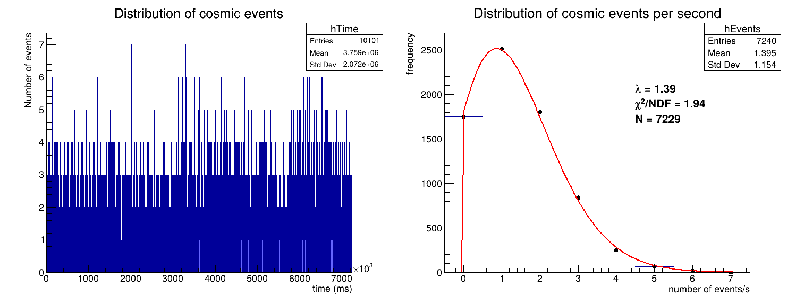
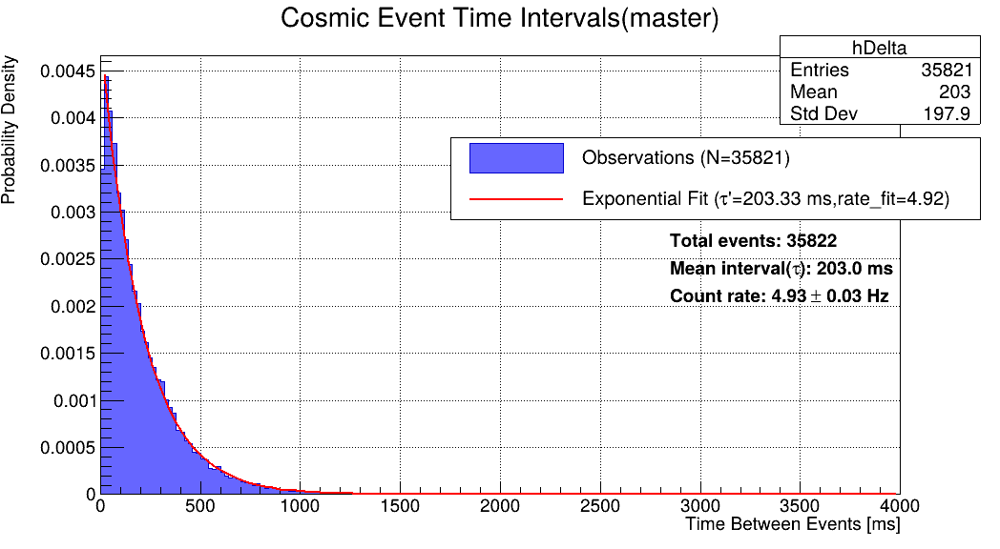
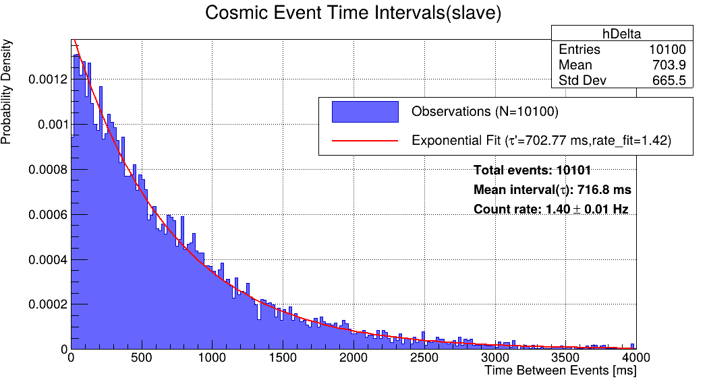
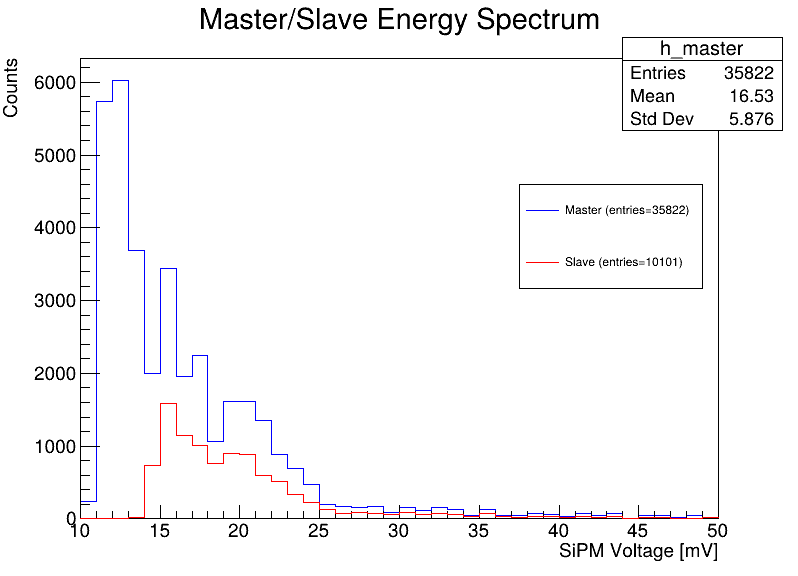
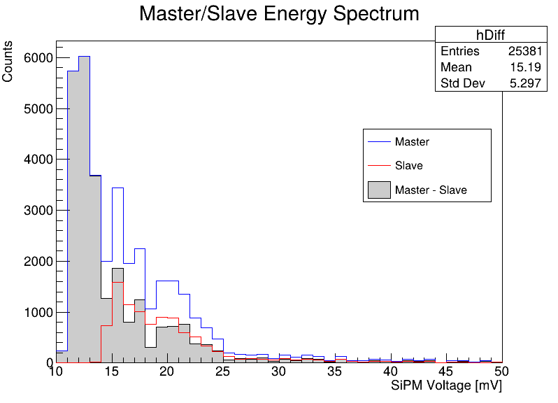
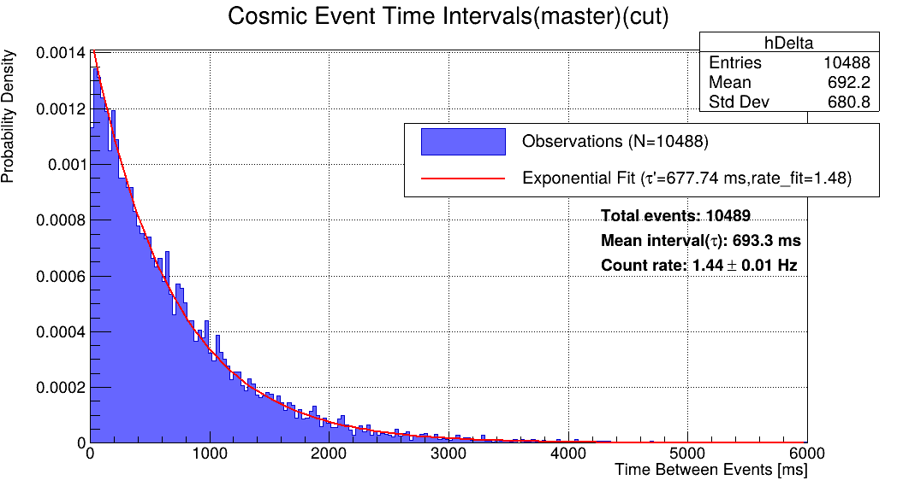
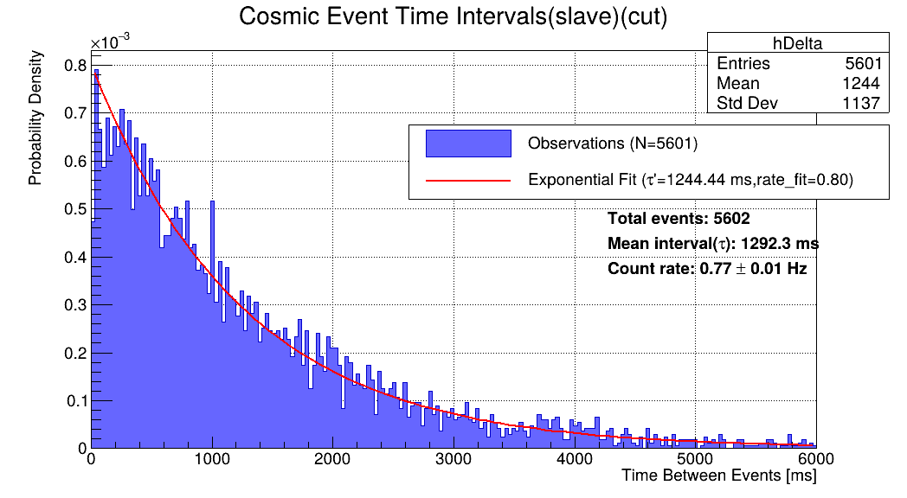

# 大气缪子实验：从探测装置搭建到数据分析

这是一个脱敏版项目展示仓库，用于记录一次大气缪子探测与数据分析实践。仓库只保留项目说明、分析图表和脱敏报告，不公开个人敏感信息、完整代码和原始实验数据。

## 项目概述

大气缪子来自宇宙射线与地球大气相互作用后的次级粒子。它们具有较强穿透能力，可以到达地面并被桌面级粒子探测器记录。本项目围绕大气缪子候选事件展开，尝试完成从探测装置搭建、信号采集到统计分析的完整流程。

项目使用塑料闪烁体和硅光倍增管 SiPM 构成探测单元。粒子穿过闪烁体时沉积能量并产生闪烁光，SiPM 将光信号转换为可测电信号，随后由微控制器记录事件时间戳、ADC 峰值、SiPM 峰值电压、运行时间和温度等信息。

为了提高信号可信度，实验引入 master/slave 主从探测器模式。master 探测器记录所有超过阈值的事件，slave 探测器只记录与 master 在短时间符合窗口内同时出现的信号，从而减少随机背景事件的影响。

## 我的工作

- 参与大气缪子探测实验装置搭建，理解塑料闪烁体、SiPM、微控制器与数据记录模块的协同工作方式。
- 理解并整理 master/slave 主从探测器的信号筛选逻辑。
- 使用 Python 与 ROOT 对实验数据进行统计分析与可视化。
- 对每秒事件数进行频率统计，并进行泊松拟合。
- 对相邻事件时间间隔进行统计，并进行指数分布拟合。
- 分析 SiPM 电压谱，比较 master 与 slave 信号分布。
- 探索基于 SiPM 电压阈值的事件筛选方法，以提升信噪比。

## 分析内容

### 1. 每秒事件数统计

将事件时间戳按秒分箱，得到每秒事件数分布。事件计数在时间轴上呈随机分布，频率直方图可用泊松分布进行近似描述。



### 2. 相邻事件时间间隔分析

对相邻两次事件的时间间隔进行统计。若事件可以近似看作独立随机到达过程，则时间间隔应接近指数分布。分析结果显示，master 与 slave 数据的时间间隔分布均可用指数函数较好描述。





### 3. SiPM 电压谱分析

SiPM 峰值电压可粗略反映探测信号强度。通过比较 master 与 slave 的电压分布，可以看到低电压区域存在明显差异，主从符合筛选后低能背景被削弱。





### 4. 电压阈值筛选

为了进一步提升筛选后事件的可信度，分析中尝试设置 SiPM 电压阈值。根据 slave 与 master 信号量比例的变化，选择约 18.0 mV 作为一个经验截断点，并观察截断前后事件时间间隔分布变化。





## 主要结果

| 分析对象 | 主要观察 |
| --- | --- |
| master 事件 | 记录事件数更多，包含更多低电压背景成分 |
| slave 符合事件 | 事件数减少，信号纯度相对提高 |
| 每秒事件数 | 分布可用泊松模型近似描述 |
| 相邻事件时间间隔 | 分布可用指数模型近似描述 |
| SiPM 电压谱 | 低电压区 master 与 slave 差异明显 |
| 阈值筛选 | 约 18.0 mV 的截断可用于初步压低低电压背景 |

## 局限性

由于探测器精度、几何布置、背景抑制和标定条件有限，不能逐事件严格确认所有记录信号均为大气缪子。更准确的表述是：本项目记录并分析了通过主从符合筛选得到的大气缪子候选事件。后续工作可以进一步引入角分布测量、屏蔽对照、效率校准、环境变量关联分析等实验设计。

## 仓库结构

```text
atmospheric-muon-analysis/
├── README.md
├── figures/
│   ├── master_vs_slave.png
│   ├── comparison_diff.png
│   ├── event_analysis.png
│   ├── time_intervals_master.png
│   ├── time_intervals_slave.png
│   ├── time_intervals_master_cut.png
│   └── time_intervals_slave_cut.png
├── report/
│   ├── muon_experiment_report_desensitized.pdf
│   └── muon_experiment_report_desensitized.tex
└── notes/
    └── analysis_pipeline.md
```

## 脱敏说明

- 不公开原始实验数据文件。
- 不公开完整分析代码。
- 仅展示项目流程、关键图表、方法说明和脱敏报告。
